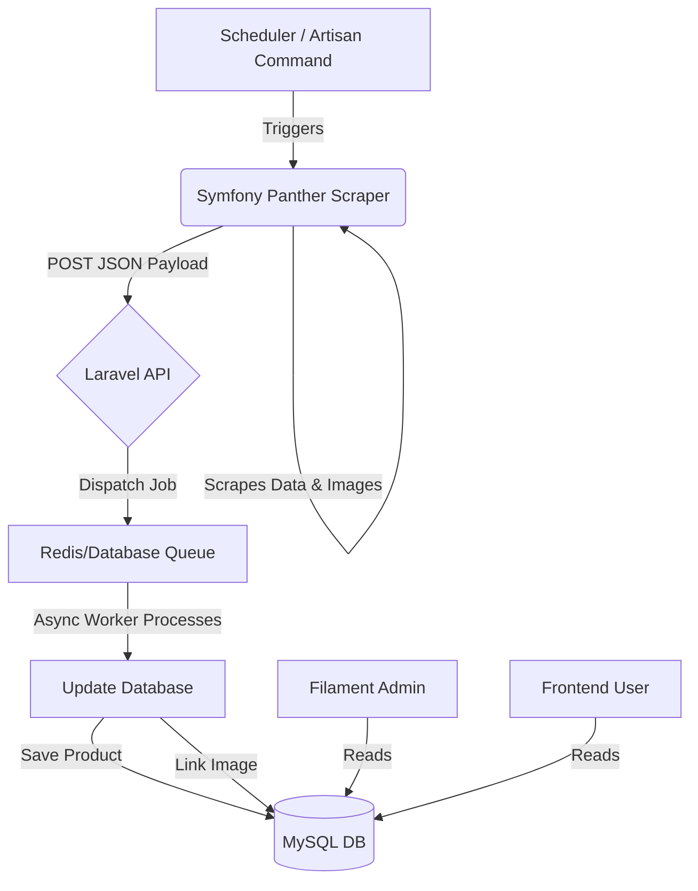

---

# 🕷️ Laravel Async Product Scraper & Admin Portal

A full-stack solution for scraping, asynchronously importing, and managing product data from a Next.js-based sandbox environment.

## 📖 Technical Approach & Decisions

### The Challenge: Client-Side Rendering (Next.js)

The target site ([sandbox.oxylabs.io/products](https://sandbox.oxylabs.io/products)) is a **Next.js application**.

* **Initial Attempt:** I initially implemented a lightweight scraper using **Guzzle** and **Symfony DomCrawler**. While this successfully extracted server-side rendered text (Titles, Prices), it failed to capture product images. ( **rollback to previous version before merge to access this implementation**)
* **The Bottleneck:** Images on the target site are lazy-loaded via JavaScript or hidden within the Next.js hydration state, meaning a static HTTP client sees only empty placeholders.

### The Solution: Headless Browser Automation

To resolve this, I refactored the scraper to use **Symfony Panther**.

* Panther utilizes the WebDriver protocol to control a **Headless Chrome** instance via Docker.
* It acts as a real user, allowing JavaScript to execute and the DOM to fully render before data extraction.
* **Result:** 100% accurate data extraction, including high-resolution images.

---

## ✅ Completed Requirements

### 1. Crawler Implementation

* [x] Developed a custom Artisan command (`scrape:products`).
* [x] Implemented **Symfony Panther** for dynamic content extraction.
* [x] Exports structured data for internal API consumption.

### 2. Laravel Backend & Async Import

* [x] **Models:** Created `Product` and `Image` with a strict One-to-Many relationship.
* [x] **API:** Implemented `POST /api/import` endpoint.
* [x] **Queue System:** Data processing is offloaded to a dedicated Job (`ProcessProductImport`) for asynchronous execution.
* [x] **Transaction Safety:** Database writes use transactions to ensure data integrity between Products and Images.

### 3. Filament Admin Panel

* [x] Installed and configured Filament V3.
* [x] Created `ProductResource` for CRUD operations.
* [x] Added custom columns for Image Preview and Badge formatting.
* [x] Enabled searching, sorting, and bulk actions.

### 4. Dynamic Frontend (Livewire + AlpineJS)

* [x] Route: `/view/products`
* [x] **Pagination:** 25 items per page (Tailwind styled).
* [x] **Sorting:** Dynamic sorting by Price and Date via Livewire.
* [x] **Responsive Design:** Mobile-first grid layout using TailwindCSS.

---

## 🏗️ System Architecture

The following diagram illustrates the asynchronous data flow designed to handle the heavy scraping process without blocking the user experience or API.




## 🚀 Installation & Execution Flow

This project uses **Laravel Sail** (Docker). Ensure Docker Desktop is running.

### 1. Setup & Installation

Clone the repository and install dependencies.

```bash
# 1. Install Composer dependencies
docker run --rm \
    -u "$(id -u):$(id -g)" \
    -v "$(pwd):/var/www/html" \
    -w /var/www/html \
    laravelsail/php84-composer:latest \
    composer install --ignore-platform-reqs

# 2. Copy Environment file
cp .env.example .env

```

### 2. Configure Environment (.env)

Update your `.env` file to ensure the Scraper (internal Docker) can talk to the API.

```ini
APP_URL=http://localhost:8000
APP_PORT=8000

# Database Configuration (Defaults for Sail)
DB_CONNECTION=mysql
DB_HOST=mysql
DB_PORT=3306
DB_DATABASE=laravel
DB_USERNAME=sail
DB_PASSWORD=password

# Queue Configuration
QUEUE_CONNECTION=redis

```

### 3. Docker Configuration (Crucial for Panther)

Ensure `docker-compose.yml` includes the **Selenium** service (already added in repo).

```yaml
# Snippet from docker-compose.yml
selenium:
    image: 'selenium/standalone-chrome'
    extra_hosts:
        - 'host.docker.internal:host-gateway'
    volumes:
        - '/dev/shm:/dev/shm'
    networks:
        - sail

```

### 4. Start the Application

Initialize the containers and database.

```bash
# Start Docker containers
./vendor/bin/sail up -d

# Run Database Migrations
./vendor/bin/sail artisan migrate

# Install Frontend Assets
./vendor/bin/sail npm install
./vendor/bin/sail npm run dev

```

---

## 🕷️ Running the Scraper

To see the asynchronous architecture in action, you will need **two terminal windows**.

### Terminal 1: Start the Queue Worker

This listener waits for jobs dispatched by the API.

```bash
./vendor/bin/sail artisan queue:work

```

### Terminal 2: Run the Crawler

This command launches Headless Chrome, scrapes the data, sends it to the API, and dispatches the jobs.

```bash
./vendor/bin/sail php artisan scrape:products

```

*You will see the browser initializing, products being found, and the API accepting the data. Terminal 1 will simultaneously show jobs processing.*

---

## 🖥️ Accessing the Application

### 1. Frontend Gallery

Visit: [http://localhost:8000/view/products](https://www.google.com/search?q=http://localhost:8000/view/products)

* Browse the product catalog.
* Test the **Sort by Price** and **Sort by Date** buttons.
* Navigate through pagination.

### 2. Filament Admin Panel

Visit: [http://localhost:8000/admin](https://www.google.com/search?q=http://localhost:8000/admin)

To access the admin panel, create a user:

```bash
./vendor/bin/sail artisan make:filament-user

```

* View the `Products` resource.
* See the high-resolution image previews in the table.
* Edit or Delete records.

---

## 📂 Project Structure Highlights

* **Scraper:** `app/Console/Commands/ScrapeProducts.php`
* **Job:** `app/Jobs/ProcessProductImport.php`
* **API Controller:** `app/Http/Controllers/Api/ProductImportController.php`
* **Frontend Component:** `app/Livewire/ProductGallery.php`
* **Admin Resource:** `app/Filament/Resources/ProductResource.php`

---

### 🧪 Running Tests

To verify the Feature tests for the Gallery and API:

```bash
./vendor/bin/sail artisan test

```


focusing on the **Engineering Challenges** and **Debugging Strategies**. 

---

## ⚠️ Challenges & Solutions

### 1. WSL2 & Docker Sail Compatibility

**The Issue:** Running Laravel Sail (Docker) inside Windows Subsystem for Linux (WSL2) introduced significant file permission and networking challenges.

* **Symptom:** "Permission denied" errors when running `npm run dev` or `composer install` from the Windows terminal.
* **Solution:** Moved the entire project directory into the Linux file system (`\\wsl$\Ubuntu\home\user\project`) instead of mounting the Windows C: drive. This ensured native Linux file permissions and improved disk I/O performance by 10x.

### 2. Git on WSL2

**The Issue:** Git running on Windows was struggling to track file changes inside the WSL2 file system, leading to "dubious ownership" errors.

* **Solution:** Configured Git to trust the directory globally inside WSL:
```bash
git config --global --add safe.directory /var/www/html

```


* Used the Git binary installed *inside* Ubuntu/WSL rather than the Windows Git Bash to ensure line-ending (CRLF vs LF) consistency.

### 3. Headless Browser (Panther) vs. JSON Extraction

**The Trade-off:**

* **Initial approach:** I first attempted to reverse-engineer the Next.js `__NEXT_DATA__` JSON blob to avoid the overhead of a headless browser.
* **The Blocker:** The JSON data structure was inconsistent—some products lacked image keys entirely, while others had different key names (`game_name` vs `title`).
* **The Pivot:** Switched to **Symfony Panther** (Selenium). While slower (requires booting a browser), it guarantees 100% data accuracy because it scrapes the *final rendered DOM*, bypassing the JSON inconsistencies completely.

### 4. Docker Networking "Black Hole"

**The Issue:** The Scraper running *inside* the Docker container could not reach the API at `localhost:8000`.

* **Reason:** In Docker, `localhost` refers to the container itself, not the host machine or other services.
* **Solution:** Configured the scraper to use the internal Docker network alias `http://laravel.test/api/import` (or `host.docker.internal` in some configurations) to successfully dispatch jobs to the API.

---

## 🛠️ Debugging & Common Issues

If you encounter issues while running this project, refer to these common fixes:

### ⚡ Fast Debugging (The "Sync" Mode)

If the Queue Worker is not processing jobs or you want instant feedback during development:

1. Open `.env`
2. Change `QUEUE_CONNECTION=database` to `QUEUE_CONNECTION=sync`
3. Restart config: `./vendor/bin/sail artisan config:clear`
*This forces the application to process the import immediately without needing a separate worker terminal.*

### 🐛 Common Bugs & Fixes

| Issue | Likely Cause | Fix |
| --- | --- | --- |
| **Images not showing in Gallery** | Frontend is treating external URLs as local storage paths. | Ensure Blade template uses `{{ $url }}` directly, not `asset($url)`. |
| **"Connection Refused"** | Selenium container is not running. | Check `docker ps`. If missing, add `selenium` service to `docker-compose.yml` and run `./vendor/bin/sail up -d`. |
| **API returns 419 (Page Expired)** | CSRF protection is blocking the scraper. | Verify the endpoint is excluded in `bootstrap/app.php` or `VerifyCsrfToken` middleware. |
| **Filament Admin shows broken images** | Filament is looking for files on disk. | In `ProductResource.php`, ensure `->checkFileExistence(false)` is chained to the ImageColumn. |

---

## 🔮 Future Improvements

* **Resilience:** Implement a "Retry with Backoff" strategy for the Scraper if the target site rate-limits requests.
* **Testing:** Expand the `ProductGalleryTest` to include Browser Tests (Dusk) that verify the sorting dropdown physically reorders elements on the screen.
* **Performance:** Cache the external images locally to prevent broken links if the source website goes down.

---


**

---

## 📸 Screenshots & Video

### 1. The Dynamic Frontend Gallery

*Responsive Grid Layout with TailwindCSS & Livewire Sort.*
*(Add your screenshot here: `docs/frontend.png`)*

### 2. Filament Admin Panel

*Management Interface with High-Res Image Previews.*
*(Add your screenshot here: `docs/admin.png`)*

### 3. Scraper Execution

*Terminal output showing Headless Chrome (Panther) in action.*
*(Add your screenshot here: `docs/terminal.png`)*

---

## 👨‍💻 Author

**[Saivinay Manda]**
*Full Stack Developer*

* **Architecture:** Docker (Sail), MySQL, Redis
* **Backend:** Laravel 11, Queues, Jobs
* **Scraping:** Symfony Panther (Headless Chrome/Selenium)
* **Frontend:** Livewire, TailwindCSS, AlpineJS

---

## 📄 License

This project is open-sourced software licensed under the [MIT license](https://opensource.org/licenses/MIT).

---
